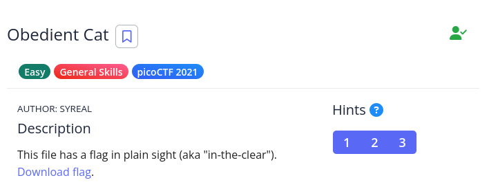

# [The Beginner's Guide to the picoGym] : Obedient Cat

## Challenge


[Download File](files/flag)

## Status


## Approach
This one's a simple one (should be). I'll look inside the file using the `cat` command (yes, I know that's a useless `cat`. But it works and works quickly, so is it really useless?).

This gives me the result of:

```bash
$ cat flag
picoCTF{s4n1ty_v3r1f13d_1a94e0f9}
```

As it states on the picoCTF site, it's more for checking if the player is using the site correctly and that the infrastructure is working.

## Solution
1.  Open the downloaded file
2.  Enter the contents of the file into the flag field

## Lessons
None.
