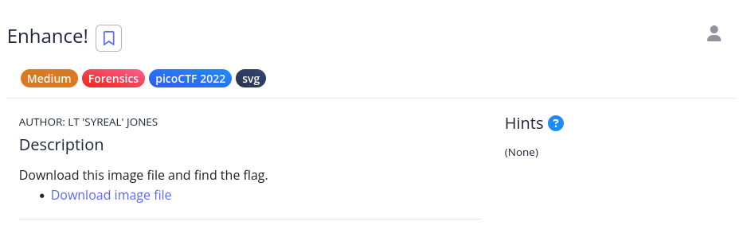
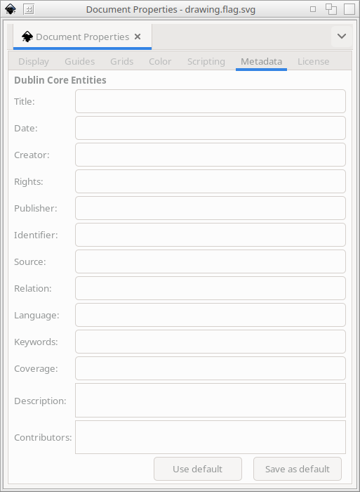

# [The Beginner's Guide to the picoGym] : Enchance!

## Challenge


## Status


## Approach
Now we're onto steganography! Let's try taking a look and seeing if the file is indeed an SVG file or not.

```sh
$ file drawing.flag.svg
drawing.flag.svg: SVG Scalable Vector Graphics image, ASCII text
```

So it looks like there's some text in there, let's see if there's anything in there that might give us the flag or lead us to a solution.

```sh
$ strings drawing.flag.svg | pico

```

That doesn't give us a result and neither does `grep flag`. It does tell us it was made or modified with the opensource program [Inkscape](https://inkscape.org/). Let's open it up in that program and see if there is anything in metadata fields that contains the flag. What you get is this image:


And the metadata shows nothing:



But wait! An SVG file is essentially instructions in XML format on how to "draw" the image. So let's take a look at the entire file and see if there are any clues in there. There's a `<text>` tag that might have the stuff we're looking for.

And what do you know? It contains a part of the flag between the tags. It spells out `picoCTF{3nh4nc3d_d0a757bf}`. Looks like I went to deep on my first attempts. I should have just outputted the contents of the file to the console.

## Solution
1.  View the text of the SVG file
2.  Scroll down to line 85 and look for the 'p`
3.  Assemble the flag between each tag (ex: Lines 90, 95, etc...)

## Lessons
Start with the most simple of strategies before moving onto more complicated ones. That may contain what you're looking for.
