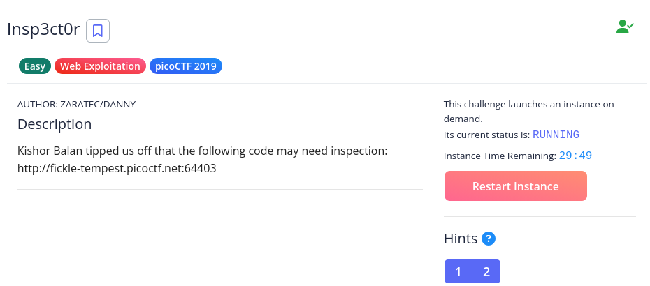

# [The Beginner's Guide to the picoGym] : Insp3ct0r

## Challenge

## Status

## Approach
With this one, it looks like we might be looking at the page's source to find the flag. Going to the site shown in the description, it takes us to a simple looking site. Right-click on the page and selecting something along the lines of `View Page Source`, show you 1/3 of the flag. Clicking on the CSS file that's being linked (`mycss.css`) and the one for the Javascript file (`myjs.js`) at the top of the source gives you the 2nd and 3rd part of the flag, respectively: `picoCTF{tru3_d3t3ct1ve_0r_ju5t_lucky?302945a7}`

## Solution
1.  Go to the website in the description
2.  View the page's source
3.  Open the CSS and Javascript file

## Lessons
None.