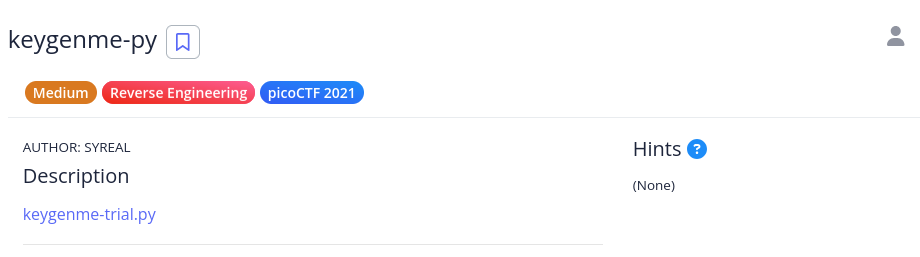

# [The Beginner's Guide to the picoGym] : keygenme-py

## Challenge


## Status


## Approach
Taking a look at the source code for the Python file we get far to much to paste here so I'll highlight some of the more interesting areas.

It looks like when you run the program, it presents you with a menu that includes:

>===============================================\n\            
Welcome to the Arcane Calculator, " + username_trial + !"                   
This is the trial version of Arcane Calculator.                    
The full version may be purchased in person near                  
the galactic center of the Milky Way galaxy.                                 
Available while supplies last!                                               
=====================================================)    
>(a) Estimate Astral Projection Mana Burn
>(b) [LOCKED] Estimate Astral Slingshot Approach Vector
>(c) Enter License Key
>(d) Exit Arcane Calculator

On line 234, we see a lot of characters that look like base64. When we decode that, it doesn't give us anything. It's likely that before the the string we have `\b` it's a byte literal. 

Looking at lines 19 to 22, it looks like part of the flag might be `picoCTF{1n_7h3_|<3y_of_xxxxxxxx}` where the series of `x`'s are dynamically generated.

Line 128 looks interesting. It asks the user for input and stores it in a variable called `user_key` that is then checked against `bUsername_trial` using the `check_key()` function to see if it will run another function called `decrypt_full_version()`. 

When we go through the code for `check_key` we see that is compares the user input to the contents of `key_full_template_trial`. First it checks to see if the length is not long enough and then it goes through the `else` code if it is. Changing the code between lines 144 and 145 to this:

```python
if len(key) != len(key_full_template_trial):
        print("Not long enough")
        return False
```

and running the program with  `picoCTF{1n_7h3_|<3y_of_xxxxxxxx}` doesn't trigger the `print` statement we just added to the code. That tells us that the key has to be that length and that the `x`'s might be what we need to figure out.

If we take a look at the code after the `else`, it run a `for` loop on `key_part_static1_trial` which equals `picoCTF{1n_7h3_|<3y_of_`. 

We can confirm this by modifying the code further:

```python
else:                                                                       
        # Check static base key part --v                                        
        i = 0                                                                   
        for c in key_part_static1_trial:                                        
            print(f"Interation: {i}")                                           
            print(f"C content: {c}")                                            
            print(f"key[i] value: {key[i]}")                                    
            if key[i] != c:                                                     
                                                                                
                return False                                                    
                                                                                
            i += 1
```

And indeed the values match up so we're on the right track! Let's take a look at the next part of the code that handles the dynamic portion. One part that needs clarification is when the variable `username_trial` is referenced in the function, does it mean the one that was passed to it {`bUsername_trial`) or the global one (`username_trial`).

If we enter in `picoCTF{1n_7h3_|<3y_of_ANDERSON}` does that give us the flag? Unfortunately no, although that does the `x`'s does line up with that word!

Doing some further digging, we see that it does produces a digest from the `username_trail` (local) that's in HEX form. But maybe there's another way to approach this problem. Let's output what `hashlib.sha256(username_trial).hexdigest()[X]}` produces and change our `picoCTF{1n_7h3_|<3y_of_xxxxxxxx}`'s `x`'s to match that. 

Modifying the code to this:

```python
# TODO : test performance on toolbox container                          
        # Check dynamic part --v                                                
        print(f"Contents of hash: {hashlib.sha256(username_trial).hexdigest()[4]}")
        print(f"Contents of hash: {hashlib.sha256(username_trial).hexdigest()[5]}")
        print(f"Contents of hash: {hashlib.sha256(username_trial).hexdigest()[3]}")
        if key[i] != hashlib.sha256(username_trial).hexdigest()[4]:                
            return False                                                           
        else:                                                                      
            print("Passed")                                                        
            i += 1                                                                 
                                                                                   
        if key[i] != hashlib.sha256(username_trial).hexdigest()[5]:             
            return False                                                        
        else:                                                                   
            print("Passed")                                                     
            i += 1                                                              
                                                                                
        if key[i] != hashlib.sha256(username_trial).hexdigest()[3]:             
            return False                                                        
        else:                                                                   
            print("Passed")                                                     
            i += 1
```

Gives us this output when we run the program with `picoCTF{1n_7h3_|<3y_of_xxxxxxxx}` as our key:

```sh
Contents of hash: 0
Contents of hash: 1
Contents of hash: 5
```

If we change out key to  `picoCTF{1n_7h3_|<3y_of_015xxxxxx}` do we get the `Passed` shown on our screen?

```sh
Contents of hash: 0
Contents of hash: 1
Contents of hash: 5
Passed
Passed
Passed
```

We do! So let's print all the results of the `hashlib.sha256(username_trial).hexdigest()[X]}` and see what number we have to use. This gives us:

```sh
Contents of hash: 0
Contents of hash: 1
Contents of hash: 5
Contents of hash: 8
Contents of hash: 2
Contents of hash: 4
Contents of hash: 1
Contents of hash: 9
```

Now let's try `picoCTF{1n_7h3_|<3y_of_01582419}`:

```sh
Full version written to 'keygenme.py'.

Exiting trial version...

===================================================

Welcome to the Arcane Calculator, tron!

===================================================


___Arcane Calculator___

Menu:
(a) Estimate Astral Projection Mana Burn
(b) Estimate Astral Slingshot Approach Vector
(c) Exit Arcane Calculator
What would you like to do, tron (a/b/c)? 

```

Bingo! That did it! Since `(b) Estimate Astral Slingshot Approach Vector` was locked behind the key, let's see what it does when we select that menu option just for fun:

```sh
What would you like to do, tron (a/b/c)? b

SOL is detected as your nearest star.
SAG-A* is deduced as your most highly viable slingshot well.

Error: You must be closer to the galactic center before calculating a slingshot approach vector.
```

Nothing too exciting. Entering our newly calculated flag gives us success!

## Solution
1.  Modify the Python program to output what values we need to enter for the `x`'s
2.  Change the `picoCTF{1n_7h3_|<3y_of_xxxxxxxx}` with the values it displayed from the modification
3.  Submit flag for points

## Lessons
You can bypass a lot of the complexity just by seeing what the contents of a variable is and what conditions need to be true for the code block to execute. I'm thinking that if some kind of Python script was running for the backend of a website and you could get access to those files, you might be able to do some damage.