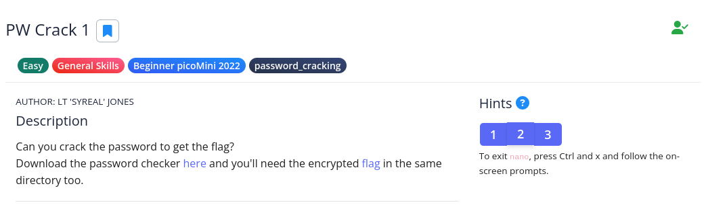

# [The Beginner's Guide to the picoGym] : PW Crack 1

## Challenge


## Status


## Approach
Again, we start by looking at the source code for the program before running it to ensure no shennanigians is occurring. It also gives us some insight into what we need to do. Loading up the source code (`level1.py`) in your favorite text editor or file output program, we get:

```python
### THIS FUNCTION WILL NOT HELP YOU FIND THE FLAG --LT ########################
def str_xor(secret, key):
    #extend key to secret length
    new_key = key
    i = 0
    while len(new_key) < len(secret):
        new_key = new_key + key[i]
        i = (i + 1) % len(key)        
    return "".join([chr(ord(secret_c) ^ ord(new_key_c)) for (secret_c,new_key_c) in zip(secret,new_key)])
###############################################################################

flag_enc = open('level1.flag.txt.enc', 'rb').read()

def level_1_pw_check():
    user_pw = input("Please enter correct password for flag: ")
    if( user_pw == "8713"):
        print("Welcome back... your flag, user:")
        decryption = str_xor(flag_enc.decode(), user_pw)
        print(decryption)
        return
    print("That password is incorrect")

level_1_pw_check()
```

Although that first code block won't help you find the flag, it's a good idea not to skip over it. At worst you learn a little something and at best you spot something that shouldn't be run on your system.

The part that'll be of interest for folks wanting the flag will be line 16 above (`if( user_pw == "8713"):`). It's a basic if-statement where if the user input is `8713` then the decrypting will take place. And indeed, running the program and entering that sequence of numbers gives us the flag.

```sh
$ python level1.py
Please enter correct password for flag: 8713
Welcome back... your flag, user:
picoCTF{545h_r1ng1ng_1b2fd683}
```

## Solution
1.  Look at the source code
2.  Find the user input that makes the flag available
3.  Run the program and enter that code (`8713`).

## Lessons
None.
