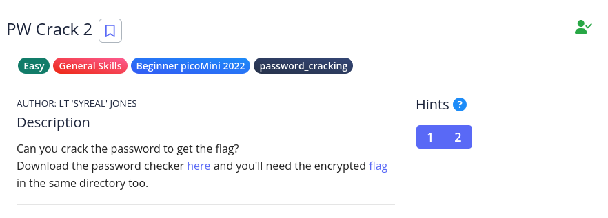

# [The Beginner's Guide to the picoGym] : PW Crack 2

## Challenge


## Status


## Approach
Same approach as the previous (and next few) challenge. Looking at the source code (`level2.py`). Instead of a frank presentation of what needs to be entered into the user input like the previous challenge, now we have these `chr(0xZZ)` entries.

Those values look like HEX so what can we do with those? Remember from a previous challenge ([bases](../bases/bases.writeup.md)) we looked at different ways to represent various characters of the latin alphabet. Is there something else that represents that?

Doing a search for an ASCII table shows us that characters can be represented by a hex (`Hx`) value (which in turn can be represented by a decimal and binary value). Below is that table (source: [www.asciitable.com](www.asciitable.com)).


The program expects the following characters in order to unlock the flag:
* chr(0x33)
* chr(0x39)
* chr(0x63)
* chr(0x65)

Using the table, this translates to:
* chr(0x33) = 3
* chr(0x39) = 9
* chr(0x63) = c
* chr(0x65) = e

Running the program with that password gives us the flag:

```sh
$ python level2.py
Please enter correct password for flag: 39ce           
Welcome back... your flag, user:
picoCTF{tr45h_51ng1ng_502ec42e}
```

## Solution
1.  Take a look at the source code
2.  Decode the needed characters using an ASCII table

## Lessons
None.
