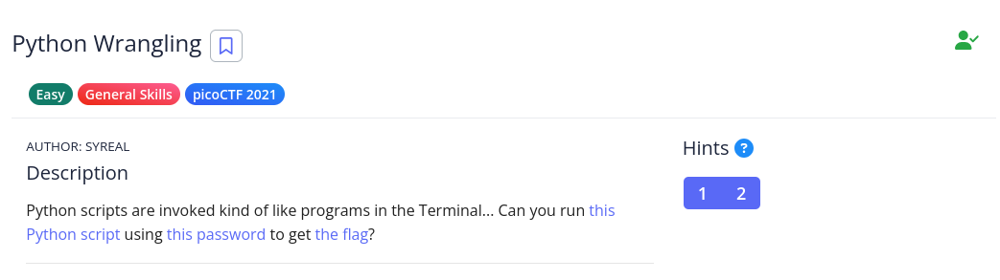

# [The Beginner's Guide to the picoGym] : Python Wrangling

## Challenge


## Status


## Approach
After downloading the [files](files/), let's look at what's contained in them. Let's start with the `flag.txt.en` and `pw.txt`. We could start look at the Python code, but sometimes we're looking to find unique solutions as that'll help with later challenges. Both files contain what looks like base64 encoded text so let's try putting in through an online decoder and see what we get. 

If you do that, you don't get much of anything resembling the flag nor do you get any text giving you any hints on how to get it. So that's likely a dead end.

Let's look at the source code for the Python file. It's generally a good idea to look at and try and understand any code before you run it (if possible). Like I've stated before in other challenges, you don't know what kind of malware might be in it.

```python

import sys
import base64
from cryptography.fernet import Fernet

usage_msg = "Usage: "+ sys.argv[0] +" (-e/-d) [file]"
help_msg = usage_msg + "\n" +\
        "Examples:\n" +\
        "  To decrypt a file named 'pole.txt', do: " +\
        "'$ python "+ sys.argv[0] +" -d pole.txt'\n"

if len(sys.argv) < 2 or len(sys.argv) > 4:
    print(usage_msg)
    sys.exit(1)

if sys.argv[1] == "-e":
    if len(sys.argv) < 4:
        sim_sala_bim = input("Please enter the password:")
    else:
        sim_sala_bim = sys.argv[3]

    ssb_b64 = base64.b64encode(sim_sala_bim.encode())
    c = Fernet(ssb_b64)

    with open(sys.argv[2], "rb") as f:
        data = f.read()
        data_c = c.encrypt(data)
        sys.stdout.write(data_c.decode())

elif sys.argv[1] == "-d":
    if len(sys.argv) < 4:
        sim_sala_bim = input("Please enter the password:")
    else:
        sim_sala_bim = sys.argv[3]

    ssb_b64 = base64.b64encode(sim_sala_bim.encode())
    c = Fernet(ssb_b64)

    with open(sys.argv[2], "r") as f:
        data = f.read()
        data_c = c.decrypt(data.encode())
        sys.stdout.buffer.write(data_c)

elif sys.argv[1] == "-h" or sys.argv[1] == "--help":
    print(help_msg)
    sys.exit(1)

else:
    print("Unrecognized first argument: "+ sys.argv[1])
    print("Please use '-e', '-d', or '-h'.")
```

It looks out base64 hunch wasn't too far off although the program might be using it in interesting ways.  It's also using the `cryptography` library and referencing Fernet. Let's do a Google search on Fernet.

From this blog post from comparitech discussing [Fernet](https://www.comparitech.com/blog/information-security/what-is-fernet/) we can see that it is not, in itself, an encryption algorithm but a piece of code (a recipe according to the blog) that uses an encryption algorithm (cryptographic primitives) that utitilizes [AES](https://en.wikipedia.org/wiki/Advanced_Encryption_Standard) and authenticates it using SHA256 as an [hash-based message authentication code](https://en.wikipedia.org/wiki/HMAC) (HMAC). 

AES is symmetric encryption which is a concept familar to a lot of folks even if they're not in the computer field. You use a "password" (secret key) and it locks a message so people can't read it or manipulate it. 

Continuing on with reading the code we see that it wants us to use the `-e` or `-d` flag to encrypt or decrypt a file, respectively. We might be using the `flag.txt.en` file with this program.

In either case, you can run the program in one of three  ways. Either you use:

* Just the `flag.txt.en` as a argument
* You append the contents of the `pw.txt` file to which is `ac9bd0ffac9bd0ffac9bd0ffac9bd0ff` like:
> `python ./ende.py -d flag.txt.end ac9bd0ffac9bd0ffac9bd0ffac9bd0ff`
* Use a bit of Linux know how and do it like this:
> python ./ende.py -d file.txt.en < pw.txt

In either case you get the following flag, `picoCTF{4p0110_1n_7h3_h0us3_ac9bd0ff}` which is what the website accepts.

## Solution
1.  Run the `ende.py` Python program using the `file.txt.en` file.
2.  Use the `pw.txt` file when prompted.

## Lessons
A deeper understanding of what AES is. That it is a block cipher which means that the data is processed in chunks (blocks) of equal length. It uses [CBC](https://en.wikipedia.org/wiki/Block_cipher_mode_of_operation#Cipher_block_chaining_(CBC)) to combine all those different chunks together. 
