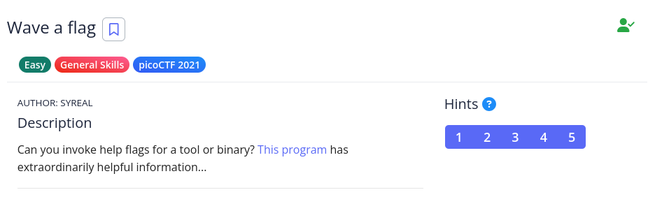

# [The Beginner's Guide to the picoGym] : Wave a flag

## Challenge


## Status


## Approach
This challenge is having us download a file named `warm` that appears to be a ELF binary as shown by running the following:

```bash
$ file warm
warm: ELF 64-bit LSB pie executable, x86-64, version 1 (SYSV), dynamically linked, interpreter /lib64/ld-linux-x86-64.so.2, for GNU/Linux 3.2.0, BuildID[sha1]=7b3da2efd83a2b9154697b6c7f6474042e1fd033, with debug_info, not stripped
```

Now there's two ways to solve this challenge, one of which I don't recommend. Let's start with that one.

### Method #1: The Dirty Way

One way to solve this challenge is to change the permissions for this file. By entering the command (or variations of it):

>$ chmod +x ./warm

It allows you to set the permission for the program to execute with whatever access you have for the file. In this case, because you downloaded the file, you'll be setting it for owner, group, and other. Once you do that you can run the program like so:

```bash
$ ./warm
Hello user! Pass me a -h to learn what I can do!
$ ./warm -h
Oh, help? I actually don't do much, but I do have this flag here: picoCTF{b1scu1ts_4nd_gr4vy_6635aa47}
```

And there we have the flag for the challenge! So why is it I don't recommend this method? Since we are only given the executable and not the source code, there's no telling what the program actually does. 

While in this case it's highly unlikely there's any kind of malware in this file, you can't be sure with other files you run into. It could show you a flag but it could also be running some kind of exploit that doesn't require you to run `sudo`. 

God help you if you're running Kali Linux not in a VM and you're logged in as `root`. Then the malware wouldn't even need to do that. You've just given it complete access to the system. 

So what's the other method?

### Method #2: The Cleaner Way

There's a Linux command called `string` that shows you all the printable characters in a file. When we ran the `file warm` command earlier, the output said "`not stripped`". That means that the characters (symbols) have not been removed from the program at the time it was compiled. By running `strings` and the `grep` command, we get some interesting results:

```bash
$ strings ./warm | grep picoCTF
Oh, help? I actually don't do much, but I do have this flag here: picoCTF{b1scu1ts_4nd_gr4vy_6635aa47}
```

It shows you the flag and you didn't have to run the program which may or may not (very likely not) have malware in it. Sometimes you can't use this method but it's a good first try and it puts you at a much lower risk.

## Solution
1.  Download the file
2.  Use Method #1 or #2 to get the flag

## Lessons
None.